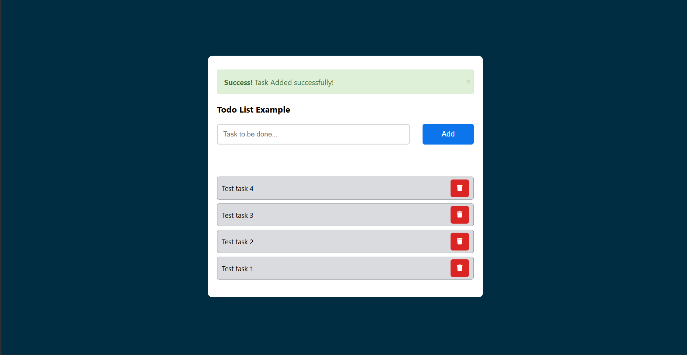

# TODO List Application

This is a simple TODO list application built using PHP, JavaScript, and MySQL. The application allows users to add, delete, and view tasks.

## Features

- Add new tasks
- Delete existing tasks
- View all tasks
- Alerts for task addition

## Prerequisites

- PHP 7.4 or higher
- MySQL 5.7 or higher
- XAMPP or any other local server environment

## Installation

1. Clone the repository to your local machine:

    ```bash
    git clone https://github.com/yourusername/todo.git
    ```

2. Navigate to the project directory:

    ```bash
    cd todo
    ```

3. Start your local server (e.g., XAMPP) and ensure Apache and MySQL are running.

4. Create a database named `todo` and import the `todo.sql` file to set up the database schema and initial data:
- I have used gui to create table and database manually from xampp myPHP admin panel.

    ```sql
    CREATE DATABASE todo;
    USE todo;
    SOURCE path/to/todo.sql;
    ```

5. Update the database connection details in [db.php](http://_vscodecontentref_/1):

    ```php
    // filepath: /C:/xampp/htdocs/TODO/db.php
    <?php
    $servername = "localhost";
    $username = "yourUsername";
    $password = "yourPass";
    $dbname = "yourDatabaseName";

    // Create connection
    $conn = new mysqli($servername, $username, $password, $dbname);

    // Check connection
    if ($conn->connect_error) {
        die("Connection failed: " . $conn->connect_error);
    }
    ?>
    ```

6. Open your browser and navigate to `http://localhost/todo`.

## File Structure

- [index.php]: The main file that displays the TODO list and handles task addition and deletion.
- [db.php]: Contains the database connection details.
- [fetchData.php]: Contains the function to fetch all tasks from the database.
- [delete.php]: Contains the function to delete a task from the database.
- [add.php]: Handles the addition of new tasks.
- [alert.php]: Displays success and error messages.
- [styles.css]: Contains the CSS styles for the application.

## Usage

1. **Add a Task**:
    - Enter the task in the input field and click the "Add" button.
    - If the task is added successfully, a success message will be displayed.
    - If the task is not added, an error message will be displayed.

2. **Delete a Task**:
    - Click the delete button (trash icon) next to the task you want to delete.
    

## Screenshots



## Contributing

1. Fork the repository.
2. Create a new branch (`git checkout -b feature-branch`).
3. Make your changes.
4. Commit your changes (`git commit -m 'Add some feature'`).
5. Push to the branch (`git push origin feature-branch`).
6. Open a pull request.


## Acknowledgements

- [Font Awesome](https://fontawesome.com/) for the icons.
- [XAMPP](https://www.apachefriends.org/index.html) for the local server environment.
